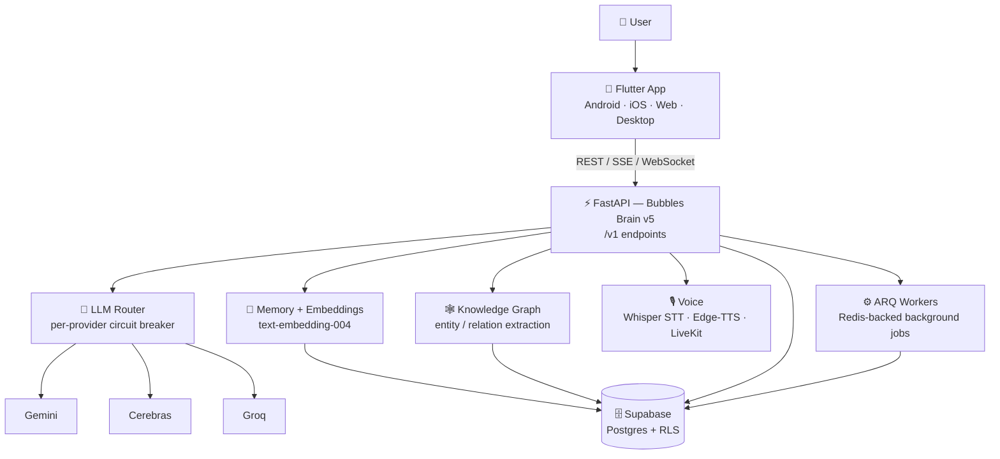

<!-- ===================== HERO ===================== -->
<div align="center">

<picture>
  <source media="(prefers-color-scheme: dark)" srcset="assets/logos/logo_light.webp">
  <source media="(prefers-color-scheme: light)" srcset="assets/logos/logo_dark.webp">
  
</picture>

# 🫧 Bubbles

### Your AI conversation co-pilot — live coaching while you talk, and a smart assistant that remembers.

<p>
  
  
  
  
  
  
</p>

<p>
  <a href="#-quick-start"><b>Quick Start</b></a> ·
  <a href="#-how-it-works"><b>How it works</b></a> ·
  <a href="#-api-reference">API</a> ·
  <a href="https://qdevaan.github.io/Bubbles-AI/">Website</a>
</p>

</div>

---

## 🌍 What is Bubbles? (in plain English)

> **Bubbles is like having a calm, clever friend in your ear during any conversation — and a sharp assistant that remembers everything afterwards.**

Imagine you're in an important chat — a job interview, a tough negotiation, a first date, a
difficult call. Bubbles **listens along** and quietly suggests what to say next, so you never
freeze or fumble. That's **Wingman mode**.

When the conversation is over, you can **ask Bubbles questions** about it — "How did I come
across?", "What should I have said differently?", "Remind me what we agreed on." That's
**Consultant mode**.

Over time, Bubbles **remembers the people and topics** you talk about, tracks how your
communication is improving, turns your slip-ups into **flashcard-style practice drills**, and
even makes it fun with **quests, streaks, and rewards**. It works by **voice** (just say the
wake word) and runs on your **phone, web, and desktop** from one app.

No jargon, no setup ritual — open it, talk, and get better at talking. 🫧

---

## ✨ Features

| | Feature | What it does for you |
|---|---|---|
| 🎧 | **Live Wingman** | Real-time, in-the-moment advice generated from the live transcript while you're still talking. |
| 💬 | **Consultant Mode** | Ask deep, context-aware questions about your conversations — blocking, streaming, or batched. |
| 🎙️ | **Voice & Wake-word** | Hands-free interaction: wake-word detection, speech-to-text, text-to-speech, speaker enrollment. |
| 🧠 | **Long-term Memory** | Vector-based recall so Bubbles remembers what mattered across all your sessions. |
| 🕸️ | **Knowledge Graph** | Automatically maps the people, topics, and entities you mention — browse them on a timeline. |
| 📈 | **Coaching Reports** | Per-session analytics, sentiment, talk-time, trends, and auto-generated coaching reports. |
| 🃏 | **Practice Drills** | Spaced-repetition (Leitner-box) flashcards built from your real mistakes. |
| 🎮 | **Gamification** | Daily quests, achievements, rewards, streaks, and an opt-in leaderboard. |
| 📱 | **Cross-platform** | One Flutter codebase → Android, iOS, Web, Windows, macOS, Linux. |

---

## 📸 Screenshots

> Drop images into `docs/screenshots/` and they'll appear here. See
> [`docs/screenshots/README.md`](docs/screenshots/README.md) for the exact filenames.

<p align="center">
  
  
  
  
</p>

---

## 🧭 How it works



**The flow:** the Flutter app talks to the FastAPI backend under `/v1`. The backend's **LLM
router** picks the best available model (Gemini → Cerebras → Groq) with automatic failover,
pulls relevant **memory/embeddings** and **knowledge-graph** context, handles **voice** via
Whisper/Edge-TTS/LiveKit, offloads heavy work to **ARQ background workers**, and persists
everything in **Supabase**.

---

## 🛠 Tech Stack

<table>
<tr>
<th align="left">📱 Client (Flutter)</th>
<th align="left">⚙️ Server (Bubbles Brain v5)</th>
</tr>
<tr valign="top">
<td>

- **Flutter 3.10+ / Dart 3.10+** — one codebase, 6 platforms
- **Provider / Riverpod** — state management
- **supabase_flutter** — auth, data, realtime
- **livekit_client** — realtime audio/video
- **speech_to_text · flutter_tts · record · flutter_sound** — audio
- **porcupine_flutter** — wake-word detection
- **sqflite · shared_preferences** — local cache (stale-while-revalidate)
- **fl_chart · force_directed_graphview** — charts & graph viz
- **webview_flutter · flutter_markdown_plus · pdf**

</td>
<td>

- **FastAPI + Uvicorn** — async top to bottom (Python 3.11+)
- **LLM router w/ circuit breaker** — Gemini → Cerebras → Groq per task
- **asyncpg over PgBouncer · SQLAlchemy 2 · Alembic** migrations
- **Supabase** — Postgres + Auth + Row-Level Security
- **Redis + ARQ** — cache, queue, cron background jobs
- **Gemini `text-embedding-004`** (bge-small ONNX offline fallback)
- **Groq Whisper STT · Edge-TTS · LiveKit** tokens
- **structlog · Prometheus · Sentry · OpenTelemetry**
- **uv · ruff · mypy --strict · pytest**

</td>
</tr>
</table>

---

## 🚀 Quick Start

> **Prerequisites:** Flutter SDK (latest stable), Python 3.11+, [`uv`](https://docs.astral.sh/uv/),
> optionally Docker Desktop, and a Supabase project. Groq + LiveKit keys for AI/voice flows.

<details>
<summary><b>1 · Configure your environment (<code>env/.env</code>)</b></summary>

<br>

Create `env/.env` in the repo root:

```env
# Supabase
SUPABASE_URL=
SUPABASE_ANON_KEY=
SUPABASE_KEY=
SUPABASE_SERVICE_KEY=

# Groq
GROQ_API_KEY=

# Deepgram (optional for STT flows)
DEEPGRAM_KEY=

# LiveKit
LIVEKIT_URL=
LIVEKIT_API_KEY=
LIVEKIT_API_SECRET=

# CORS (comma-separated origins or *)
ALLOWED_ORIGINS=*
```

- The Flutter app loads `env/.env` in development.
- The backend reads `env/.env` first, then falls back to `server/.env`.
- For production Flutter builds, prefer `--dart-define` for secrets.

</details>

<details>
<summary><b>2 · Run the backend with Docker (recommended)</b></summary>

<br>

From the `server/` directory:

```bash
docker compose up --build
```

Backend is then available at:

- API: `http://localhost:8000`
- Health: `http://localhost:8000/health`

The `worker` service in `docker-compose.yml` runs the ARQ background-job worker.

</details>

<details>
<summary><b>2b · Run the backend locally (without Docker)</b></summary>

<br>

From the `server/` directory (needs [`uv`](https://docs.astral.sh/uv/)):

```bash
uv sync                # create venv + install deps from pyproject/uv.lock
cp .env.example .env   # fill in secrets
make dev               # uvicorn --reload on :8000
```

- `make test` → `ruff` + `mypy --strict` + `pytest`
- `make migrate` → apply Alembic migrations

Full developer experience is documented in [`server/README.md`](server/README.md).

</details>

<details>
<summary><b>3 · Run the Flutter app</b></summary>

<br>

From the repository root:

```bash
flutter pub get
flutter run
```

Inject secrets at runtime (recommended for release & CI):

```bash
flutter run \
  --dart-define=SUPABASE_URL=your_supabase_url \
  --dart-define=SUPABASE_ANON_KEY=your_supabase_anon_key
```

</details>

---

## 📡 API Reference

Routers are mounted as: health (`/live`, `/ready`, `/deep`), metrics (`/metrics`), and
business endpoints under **`/v1`**.

<details>
<summary><b>Full <code>/v1</code> endpoint list</b> (click to expand)</summary>

<br>

**Sessions**

| Method | Path |
|--------|------|
| POST | `/v1/start_session` |
| POST | `/v1/save_session` |
| POST | `/v1/end_session` |
| POST | `/v1/log_turn` |
| GET  | `/v1/session_replay/{session_id}` |
| POST | `/v1/sessions/{session_id}/context` |
| POST | `/v1/sessions/{session_id}/confidence` |
| POST | `/v1/suggest_reply` |
| DELETE | `/v1/sessions/{session_id}` |

**Wingman**

| Method | Path |
|--------|------|
| POST | `/v1/process_transcript_wingman` |

**Consultant**

| Method | Path |
|--------|------|
| POST | `/v1/ask_consultant` (streaming) |
| POST | `/v1/ask` |
| POST | `/v1/ask_consultant/batch` |

**Voice & Speaker**

| Method | Path |
|--------|------|
| POST | `/v1/getToken` |
| POST | `/v1/process_audio` |
| POST | `/v1/tts` |
| POST | `/v1/voice_command` |
| POST | `/v1/enroll` |
| POST | `/v1/identify_speaker` |

**Grammar**

| Method | Path |
|--------|------|
| POST | `/v1/check_user_turn` |
| GET  | `/v1/user_mistakes` |

**Analytics & Dashboard**

| Method | Path |
|--------|------|
| POST | `/v1/save_feedback` |
| GET  | `/v1/session_analytics/{session_id}` |
| GET  | `/v1/coaching_report/{session_id}` |
| GET  | `/v1/digest/{user_id}` |
| GET  | `/v1/communication_trends/{user_id}` |
| GET  | `/v1/performance_summary/{user_id}` |
| GET  | `/v1/dashboard` |

**Entities & Memory**

| Method | Path |
|--------|------|
| POST | `/v1/ask_entity` |
| GET  | `/v1/graph_export/{user_id}` |
| GET  | `/v1/entity_timeline/{entity_id}` |
| DELETE | `/v1/entities/{entity_id}` |
| DELETE | `/v1/memories/{memory_id}` |

**Drills**

| Method | Path |
|--------|------|
| GET  | `/v1/drills/queue` |
| POST | `/v1/drills/{card_id}/review` |
| POST | `/v1/drills/{card_id}/retire` |

**Scenarios**

| Method | Path |
|--------|------|
| GET  | `/v1/scenarios` |
| POST | `/v1/scenarios/generate` |
| POST | `/v1/scenarios/{scenario_id}/start` |
| POST | `/v1/scenarios/{scenario_id}/dismiss` |

**Gamification**

| Method | Path |
|--------|------|
| GET  | `/v1/gamification/{user_id}` |
| GET  | `/v1/quests/{user_id}` |
| GET  | `/v1/rewards/{user_id}` |
| POST | `/v1/rewards/{user_id}/redeem` |
| GET  | `/v1/leaderboard` |
| POST | `/v1/leaderboard/{user_id}/opt_in` |
| POST | `/v1/quests/{user_id}/{user_quest_id}/answer` |
| POST | `/v1/quests/{user_id}/{user_quest_id}/attach_session` |

**Persona**

| Method | Path |
|--------|------|
| GET  | `/v1/me/persona` |
| PUT  | `/v1/me/persona` |

</details>

---

## 📂 Repository Structure

<details>
<summary><b>Project tree</b> (click to expand)</summary>

<br>

```text
Bubbles-AI/
├─ lib/                      # Flutter app (screens, providers, repositories, services, models)
│  ├─ app/                   # bootstrap, routing, global providers
│  ├─ screens/               # 25+ UI screens
│  ├─ providers/             # state holders
│  ├─ repositories/          # data access over a custom cache
│  ├─ cache/                 # BaseRepository + stale-while-revalidate policies
│  └─ services/              # API client, auth, voice, STT/TTS, notifications
├─ assets/                   # logos, fonts (Manrope), wake-word model, text
├─ server/                   # Bubbles Brain API v5 (active backend)
│  ├─ src/bubbles/
│  │  ├─ api/                # health, metrics, and /v1 routers
│  │  ├─ ai/                 # LLM router, providers, embeddings, extraction, prompts
│  │  ├─ voice/              # STT, TTS, LiveKit
│  │  ├─ db/                 # SQLAlchemy models + repository layer
│  │  ├─ core/               # circuit breaker, rate limit, logging, tracing
│  │  └─ workers/            # ARQ background jobs
│  ├─ alembic/               # versioned, reversible migrations
│  ├─ tests/                 # unit / integration / e2e
│  ├─ ops/                   # Grafana dashboards, alert rules
│  ├─ pyproject.toml         # deps + tooling (uv, ruff, mypy, pytest)
│  ├─ Dockerfile             # multi-stage (runtime + worker targets)
│  └─ docker-compose.yml     # dev: app + redis + caddy
├─ docs/                     # GitHub Pages landing site + screenshots
├─ Documentation/            # design notes, reviews, schema reference
├─ env/                      # local environment files (git-ignored)
└─ android/ ios/ web/ macos/ linux/ windows/
```

</details>

---

## 🧰 Troubleshooting

<details>
<summary><b>Common issues</b></summary>

<br>

| Symptom | Fix |
|---------|-----|
| App fails at startup with Supabase errors | Confirm `SUPABASE_URL` and `SUPABASE_ANON_KEY` are set correctly. |
| Backend `/health` returns degraded | Verify DB credentials, `GROQ_API_KEY`, and model availability. |
| CORS errors in web builds | Set `ALLOWED_ORIGINS` to include your frontend origin(s). |
| Voice features not working | Validate LiveKit keys; ensure microphone permission is granted. |
| Slow first backend startup | Initial model/embedding downloads can take time on first boot. |

</details>

---

## 🤝 Contributing

Contributions are welcome!

1. Fork the repo and create a feature branch.
2. Backend: run `make test` (`ruff` + `mypy --strict` + `pytest`) before pushing.
3. Flutter: run `flutter analyze` and `flutter test`.
4. Open a PR with a clear description. PRs are welcome. 🎉

---

## 📄 License

Released under the [MIT License](LICENSE) © 2026 Muhammad Ahmad.
